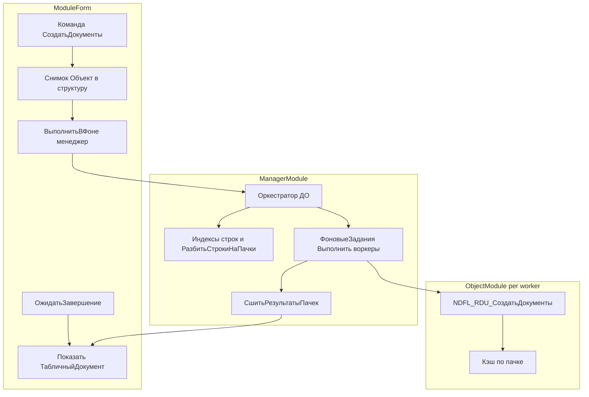

# IMDEV-7330: полный план внедрения доработок расширения NDFL_RDU

Документ объединяет техническое задание [imdev7330_ndfl_longops_n_batches_spec.html](imdev7330_ndfl_longops_n_batches_spec.html), краткий план [imdev7330_parallel_ndfl_implementation_plan.md](imdev7330_parallel_ndfl_implementation_plan.md) и согласованные уточнения (менеджер для ДО и ФЗ, кэш вариант A, лог через ТЗ сообщений, сигнатура разбиения по индексам строк).

---

## 1. Цель и границы

**Цель:** команда формирования начислений НДФЛ по обработке `ФормированиеНачисленийНДФЛ` выполняется как одна длительная операция БСП с окном ожидания; табличная часть `ДатыДокументов` обрабатывается параллельно по непустым пачкам (число окон задаётся константой расширения `NDFL_RDU_ЧислоПараллельныхПачекФормированияНДФЛ`).

**Вне объёма:** новые общие модули не вводятся. Изменения — в расширении `NDFL_RDU`: модуль формы заимствованной обработки, `Ext/ManagerModule.bsl`, `Ext/ObjectModule.bsl`, уже существующие заимствования документов (по ТЗ п. 3).

**Инварианты (ТЗ п. 5, 5.1, 5.2):**

- Один логический проход типового `ПродолжитьВызов` на строку в рамках одного экземпляра воркера: не дублировать полный прогон по всей ТЧ из UI при включённом параллельном режиме.
- Пересечение отбора `НомерСтрокиС` / `НомерСтрокиПо` с окнами пачек явно; в шапке воркера после копирования — `0` / `0`, строки ТЧ воркера уже отфильтрованы; при необходимости перенумерация `НомерСтроки` в воркере 1..N (ТЗ п. 5.1).
- Кэш оборотов: **вариант A** — в каждом воркере свой кэш, собранный только по данным пачки; параметризовать `NDFL_RDU_СобратьПарыКлиентУКСУчетомОтборовДокументов` и `NDFL_RDU_ИнициализироватьКэшОборотовПоМассивуПар` по **массиву номеров строк** (или эквивалентному явному срезу). Запрещён общий статический кэш между разными фоновыми заданиями (ТЗ и мастер-план).

---

## 2. Текущее состояние репозитория (точка отсчёта)

Уже выполнено:

- Метаданные обработки: расширены `ObjectModule` и `ManagerModule` ([ФормированиеНачисленийНДФЛ.xml](../Расширения/NDFL_RDU/DataProcessors/ФормированиеНачисленийНДФЛ.xml)).
- [Ext/ManagerModule.bsl](../Расширения/NDFL_RDU/DataProcessors/ФормированиеНачисленийНДФЛ/Ext/ManagerModule.bsl): область `IMDEV7330_ПараллельноеФормированиеНДФЛ`, экспорты-заглушки с документирующими комментариями; `NDFL_RDU_РазбитьСтрокиНаПачки(ИндексыСтрок, КоличествоПачекПользователя)`.
- [Ext/ObjectModule.bsl](../Расширения/NDFL_RDU/DataProcessors/ФормированиеНачисленийНДФЛ/Ext/ObjectModule.bsl): перехваты и кэш; область `IMDEV7330_ПараллельноеФормированиеНДФЛ_Объект` с комментариями по пачкам.
- [Forms/Форма/Ext/Form/Module.bsl](../Расширения/NDFL_RDU/DataProcessors/ФормированиеНачисленийНДФЛ/Forms/Форма/Ext/Form/Module.bsl): область с перечислением методов и строкой `Обработки.ФормированиеНачисленийНДФЛ.NDFL_RDU_ОркестраторФормированияНДФЛ`.
- HTML-ТЗ синхронизировано с менеджером, п. 3.2, 3.5, 3.5.1, диаграмма п. 12.

Остаётся: **реализация тел** по итерациям ниже, подключение команды формы к ДО, рефакторинг сбора пар/кэша под номера строк (итерация 2).

---

## 3. Архитектура размещения кода

| Слой | Файл | Ответственность |
|------|------|-----------------|
| Клиент / сервер формы | `Forms/Форма/Ext/Form/Module.bsl` | Валидации как у типовой формы; снимок данных в сериализуемую структуру; `ДлительныеОперации.ВыполнитьВФоне` на менеджер; `ДлительныеОперацииКлиент.ОжидатьЗавершение`; чтение результата из ВХ; один итоговый `ТабличныйДокумент` (ТЗ п. 2.1, 4, 8). |
| Менеджер обработки | `Ext/ManagerModule.bsl` | `NDFL_RDU_ОркестраторФормированияНДФЛ` — тело основной ДО; `NDFL_RDU_ВыполнитьПачкуФормированияНДФЛ` — воркер для `ФоновыеЗадания.Выполнить`; разбиение, подготовка параметров пачки, сшивка результатов (ТЗ п. 3.5, 5, 6). |
| Объект обработки | `Ext/ObjectModule.bsl` | Перехваты `NDFL_RDU_СоздатьДокументы` и др.; кэш; после доработки — сбор пар и инициализация кэша по подмножеству строк (ТЗ п. 3.4, 3.6, 5.2). |

**Второй слой параллелизма:** воркеры — только `ФоновыеЗадания.Выполнить` на экспорт менеджера (не вложенные `ДлительныеОперации` по пачкам). Строка основной ДО: `Обработки.ФормированиеНачисленийНДФЛ.NDFL_RDU_ОркестраторФормированияНДФЛ` (ТЗ п. 3.5.1, 8.2).

---

## 4. Контракты данных (ТЗ п. 6)

**Параметры пачки (структура для воркера):** поля `НомерПачки`, `ВсегоПачек`, `Шапка` (структура реквизитов), `СтрокиДатыДокументов` (`ТаблицаЗначений`), `ПараметрыЗапуска` (служебное, в т.ч. адреса ВХ прогресса при итерации 2, `УникальныйИдентификатор` формы для итерации 3).

**Результат пачки:** `НомерПачки`, `СписокСообщений` (`ТаблицаЗначений` с колонками минимум для сортировки: порядок, дата/время, тип, текст, при необходимости номер исходной строки и номер пачки), `ТабличныйДокумент` (фрагмент или пустой по выбранной стратегии), `ЕстьОшибка`, `ТекстОшибки`.

**Итог оркестратора во ВХ:** структура, согласованная с формой: итоговый `ТабличныйДокумент`, объединённая таблица/список сообщений, флаги ошибок, перечень упавших пачек (итерация 2–3).

Предпочтение по логу (мастер-план): накапливать сообщения в **ТЗ**, сортировать по ключам, затем **один** проход формирования итогового `ТабличныйДокумент`; не склеивать несколько ТД через многократный `Вывести()` без необходимости.

---

## 5. Итерация 1: один фон, без ФЗ

**Цель:** пользователь видит стандартное окно ДО; внутри оркестратор создаёт один объект обработки, переносит данные из параметров, вызывает `СоздатьДокументы(ТабличныйДокумент)`; результат во ВХ; форма показывает лог как сейчас при синхронном вызове.

### 5.1. Модуль формы

1. Найти типовой обработчик команды «Создать документы» в базовой форме ([WORK WIM_FIn](file:///c:/1c/Cursor_1c/WORK/WIM_FIn/src/cf/DataProcessors/ФормированиеНачисленийНДФЛ/Forms/Форма/Ext/Form/Module.bsl)) и в заимствованной форме расширения.
2. Ввести ветвление (флаг функциональной опции / константа «всегда ДО» / отдельная команда — по решению проекта; минимально для IMDEV-7330: **замена** синхронного пути на ДО, либо явный переключатель в коде на период отладки).
3. **Клиент:** перед сервером — те же проверки, что в типовой ветке (например счёт оплаты НДФЛ при `СоздаватьОплатуНДФЛ`, см. пример в мастер-плане).
4. **`NDFL_RDU_ЗапуститьПараллельноеФормированиеНаСервере` (`&НаСервере`, функция):**
   - `РеквизитФормыВЗначение("Объект")` в локальную переменную;
   - сериализовать в структуру реквизиты шапки и табличную часть `ДатыДокументов` (или иной контракт, согласованный с оркестратором — без ссылок на `ЭтотОбъект` внутри параметров ДО);
   - `ПараметрыВыполнения = ДлительныеОперации.ПараметрыВыполненияВФоне(УникальныйИдентификатор)` от формы;
   - `КлючФоновогоЗадания`, `НаименованиеФоновогоЗадания`, `ОжидатьЗавершение = 0`;
   - `АдресРезультата` через `ПоместитьВоВременноеХранилище(Неопределено, УникальныйИдентификатор)` и передать в параметры выполнения;
   - `ДлительныеОперации.ВыполнитьВФоне(..., "Обработки.ФормированиеНачисленийНДФЛ.NDFL_RDU_ОркестраторФормированияНДФЛ", ПараметрыПроцедуры, ПараметрыВыполнения)`;
   - вернуть структуру результата запуска БСП (как в референсе Wim_Du, ТЗ п. 8).
5. **`NDFL_RDU_НачатьОжиданиеПараллельногоФормирования` (`&НаКлиенте`):** `ПараметрыОжидания`, `ВыводитьОкноОжидания`, `ВыводитьПрогрессВыполнения`, `ОписаниеОповещения` на `NDFL_RDU_ОбработатьРезультатПараллельногоФормирования` (ТЗ п. 8.3).
6. **`NDFL_RDU_ОбработатьРезультатПараллельногоФормирования`:** прочитать структуру из ВХ по адресу из результата; вывести `ТабличныйДокумент`; при необходимости синхронизировать реквизиты формы из результата; обработать `Статус` «Выполнено» сразу (файловая ИБ), «Ошибка» — показ диагностики (ТЗ п. 8.1, 10).

Для каждой новой экспортной серверной функции формы — полный блок комментариев `// Описание:`, параметры, возврат, пример (стандарт комментирования проекта).

### 5.2. `NDFL_RDU_ОркестраторФормированияНДФЛ` (итерация 1)

1. В начале — инициализация структуры результата «неуспех»; в конце успешного сценария — запись во ВХ по `АдресРезультата`; в `Попытка` / `Исключение` — ЖР и запись диагностики во ВХ (ТЗ п. 8.4).
2. Разбор входных `Параметры`: проверка обязательных полей через `Свойство`.
3. `ОбъектОбработки = Обработки.ФормированиеНачисленийНДФЛ.Создать()`; заполнить шапку и ТЧ из параметров (зеркально тому, как форма снимала данные).
4. Создать `ТабличныйДокумент` для лога; вызвать `ОбъектОбработки.СоздатьДокументы(ТабличныйДокумент)` — сработает `NDFL_RDU_СоздатьДокументы`.
5. Упаковать в результат: ссылка или двоичные данные ТД (если нужно хранить во ВХ — по правилам БСП вашей базы: либо сериализуемое представление, либо повторное формирование на клиенте из ТЗ сообщений — зафиксировать один способ и описать в комментарии оркестратора).
6. **Без** `ФоновыеЗадания.Выполнить` на итерации 1.

### 5.3. Критерии приёмки итерации 1

- Окно ДО отображается; после завершения — тот же по смыслу лог, что при типовом синхронном запуске на том же наборе данных.
- Нет второго вызова полного `СоздатьДокументы` по всей ТЧ из формы.
- `cfe-validate` на каталог расширения; ручной сценарий из ТЗ п. 11 (заполнить — сформировать).

---

## 6. Итерация 2: пачки, ФЗ, прогресс, сшивка, кэш по пачке

### 6.1. Сбор индексов строк (до `NDFL_RDU_РазбитьСтрокиНаПачки`)

В менеджере (неэкспорт или локально в оркестраторе):

1. По снимку шапки и таблицы `ДатыДокументов` из параметров оркестратора построить упорядоченный массив **номеров строк** (`НомерСтроки` строки ТЧ), учитывая:
   - пересечение с `НомерСтрокиС` / `НомерСтрокиПо` (логика как в текущем `NDFL_RDU_СобратьПарыКлиентУКСУчетомОтборовДокументов` — цикл с `Прервать` по верхней границе);
   - флаг `НеСоздаватьДокументыПоКлиентамБезЦБ` и список клиентов с ЦБ (аналогично существующей функции).
2. Пустой массив — немедленный штатный ответ без статуса «Ошибка» (ТЗ п. 10).

### 6.2. `NDFL_RDU_РазбитьСтрокиНаПачки(ИндексыСтрок, КоличествоПачекПользователя)`

Реализовать по ТЗ п. 5 и п. 11:

- Геометрия до **K** непересекающихся окон на полном упорядоченном списке отобранных индексов;
- **Удалить пустые пачки** после распределения;
- Правило **не разносить строки одного клиента по разным пачкам** — упаковка групп клиента в K контейнеров с минимизацией конфликтов (ТЗ п. 5); при необходимости отдельная внутренняя процедура «упаковка по клиенту»;
- Порог **«одна пачка»** при малом объёме: если число отобранных строк **меньше** `2 * K` (или иной порог, зафиксированный в команде) — вернуть **один** массив индексов как одну пачку без искусственного дробления (мастер-план);
- Возврат: массив элементов — каждый элемент массив номеров строк **или** массив структур с полями `НомераСтрок`, `НомерПачки` — согласовать с `NDFL_RDU_ПодготовитьПараметрыПачки`.

### 6.3. `NDFL_RDU_ПодготовитьПараметрыПачки`

Собрать структуру п. 6.1: `НомерПачки`, `ВсегоПачек`, `Шапка`, `СтрокиДатыДокументов` (копия строк по индексам из исходной ТЗ), `ПараметрыЗапуска` (в т.ч. адрес общего ВХ прогресса, идентификатор формы для итерации 3).

### 6.4. `NDFL_RDU_ЗаполнитьОбработкуИзПараметровПачки`

На объекте воркера: перенос шапки из структуры; очистка и заполнение ТЧ только строками пачки; `НомерСтрокиС = 0`, `НомерСтрокиПо = 0`; перенумерация `НомерСтроки` 1..N (ТЗ п. 5.1).

### 6.5. `NDFL_RDU_ВыполнитьПачкуФормированияНДФЛ`

1. `Попытка` / `Исключение` вокруг логики пачки; в `Исключение` — заполнить `ЕстьОшибка`, `ТекстОшибки`, ЖР с **номером пачки** / идентификатором ФЗ (ТЗ п. 9, мастер-план).
2. `ОбъектВоркер = Обработки.ФормированиеНачисленийНДФЛ.Создать()`; `NDFL_RDU_ЗаполнитьОбработкуИзПараметровПачки(ОбъектВоркер, ПараметрыПачки)`.
3. **Кэш (вариант A):** вызвать доработанные `NDFL_RDU_СобратьПары...` / `NDFL_RDU_ИнициализироватьКэш...` с **ограничением по номерам строк пачки** (новые параметры или обход только строк воркера — без чтения «всего» объекта-оригинала).
4. Локальный `ТабличныйДокумент`; накопление сообщений в `ТаблицаЗначений` с колонками для последующей сортировки (мастер-план).
5. `ОбъектВоркер.СоздатьДокументы(ТабличныйДокумент)`; упаковать результат пачки; поместить во ВХ по адресу из параметров пачки (или вернуть через механизм, согласованный с оркестратором).

Ошибка **одной** пачки не должна ронять остальные: исключение воркера не должно прерывать другие ФЗ без явной политики (ТЗ п. 9).

### 6.6. Оркестратор (итерация 2)

1. Чтение `K` из константы; валидация диапазона (метаданные константы + дублирование в коде по ТЗ).
2. Сбор индексов; вызов `NDFL_RDU_РазбитьСтрокиНаПачки`; удаление пустых пачек; ветка одной пачки при малом N.
3. Подготовить **общее** ВХ состояния прогресса (структура или ТЗ: номер пачки, процент 0–100, текст этапа, вес = число строк) — ТЗ п. 7, мастер-план.
4. **Одномоментный** старт: для каждой непустой пачки `ФоновыеЗадания.Выполнить(Метаданные.Обработки.ФормированиеНачисленийНДФЛ, "NDFL_RDU_ВыполнитьПачкуФормированияНДФЛ", МассивПараметров)` — уточнить сигнатуру `Выполнить` по версии платформы и БСП в WIM_FIn (имя метода, состав массива).
5. Цикл: `ФоновыеЗадания.ОжидатьЗавершения` (или поочерёдный опрос — минимизировать блокировки); чтение прогресса из ВХ; `ДлительныеОперации.СообщитьПрогресс` с взвешенным процентом и строкой вида `Пачка1-20%; Пачка2-25%; ...` (ТЗ п. 4.2, 7.1).
6. Сбор частичных результатов; проверка аварийного завершения заданий (ТЗ п. 8.5, 8.6).
7. `NDFL_RDU_СшитьРезультатыПачекФормированияНДФЛ`: объединение ТЗ сообщений, сортировка; формирование **одного** итогового `ТабличныйДокумент`; сводка ошибок по пачкам.
8. Запись итога во ВХ основной ДО.

### 6.7. Рефакторинг `ObjectModule.bsl`

- Расширить `NDFL_RDU_СобратьПарыКлиентУКСУчетомОтборовДокументов`: необязательный параметр `МассивНомеровСтрокДляОграничения` (`Неопределено` = текущее поведение «все строки объекта»). Внутри цикла `ДатыДокументов` — пропуск строк, чей `НомерСтроки` не входит в множество (или заранее отфильтровать обход).
- Аналогично инициализация кэша: пары только из отфильтрованных строк.
- Сохранить обратную совместимость для синхронного полного прогона (вызов без параметра = полный объект).

### 6.8. Критерии приёмки итерации 2

- Тесты из ТЗ п. 10: идентичность результатов 1 поток vs N потоков; прогресс; разбиение K и отбор строк; ошибка в одной пачке; пустой набор; нагрузочный сценарий по возможности.

---

## 7. Итерация 3: отмена и устойчивость

1. Проброс **`УникальныйИдентификатор` формы** в параметры основной ДО и в параметры каждого ФЗ (ТЗ п. 9, мастер-план).
2. В оркестраторе периодически: проверка отмены родительского задания ДО (`ДлительныеОперации.ЗаданиеАктивно` или аналог БСП вашей редакции); при отмене — найти дочерние ФЗ по сохранённым идентификаторам и вызвать `Отменить()` (ТЗ п. 9).
3. Частичный успех: итоговый лог содержит свод по завершённым пачкам и явный перечень незавершённых / упавших.
4. Краевые случаи: экстремальные K, пустая ТЧ, файловая ИБ и синхронное «Выполнено» (ТЗ п. 10).

---

## 8. Тестирование и регрессия

Матрица — [imdev7330_ndfl_longops_n_batches_spec.html](imdev7330_ndfl_longops_n_batches_spec.html#oshibki) раздел 5 (тесты и регрессия): сравнение 1 vs N потоков, прогресс, разбиение, ошибка пачки, пустой набор, синхронное выполнение, нагрузка; детализация по ТЗ п. 10 при необходимости вынесена в регламент тестирования.

После каждой итерации: `cfe-validate` на `Расширения/NDFL_RDU`; загрузка в ИБ по регламенту проекта; ручной сценарий п. 11 ТЗ.

---

## 9. Риски и зависимости

| Риск | Митигация |
|------|-----------|
| Расхождение сигнатуры `ДлительныеОперации.ВыполнитьВФоне` / контракта оркестратора с редакцией БСП | Сверить с рабочей конфигурацией WIM_FIn и типовыми вызовами ДО по обработкам. |
| Сериализация `ТабличныйДокумент` во ВХ | Выбрать один подход (ТД во ВХ, или только ТЗ сообщений на сервере + сборка ТД на клиенте). |
| Блокировки и нагрузка на кластере при большом K | Верхняя граница константы и мониторинг (ТЗ п. 9, предупреждение в HTML). |
| Гонки кэша | Строго вариант A и запрет общего кэша между ФЗ (п. 1). |

---

## 10. Порядок работ (чеклист разработчика)

1. Итерация 1: форма (ветвление, три метода) — менеджер (тело оркестратора) — проверка на ИБ — тесты п. 10 для одного потока.
2. Итерация 2: сбор индексов — `РазбитьСтрокиНаПачки` — подготовка/заполнение воркера — рефакторинг сбора пар и кэша в `ObjectModule` — воркер — оркестратор ФЗ + прогресс + сшивка — тесты п. 10 полной матрицы.
3. Итерация 3: отмена, краевые случаи, доработка сообщений пользователю.

---

## 11. Связанные файлы (основной список)

- [imdev7330_ndfl_longops_n_batches_spec.html](imdev7330_ndfl_longops_n_batches_spec.html)
- [imdev7330_parallel_ndfl_implementation_plan.md](imdev7330_parallel_ndfl_implementation_plan.md)
- `Расширения/NDFL_RDU/DataProcessors/ФормированиеНачисленийНДФЛ/Ext/ManagerModule.bsl`
- `Расширения/NDFL_RDU/DataProcessors/ФормированиеНачисленийНДФЛ/Ext/ObjectModule.bsl`
- `Расширения/NDFL_RDU/DataProcessors/ФормированиеНачисленийНДФЛ/Forms/Форма/Ext/Form/Module.bsl`
- Типовая форма (референс): `C:\1c\Cursor_1c\WORK\WIM_FIn\src\cf\DataProcessors\ФормированиеНачисленийНДФЛ\Forms\Форма\Ext\Form\Module.bsl`

Конец документа.
