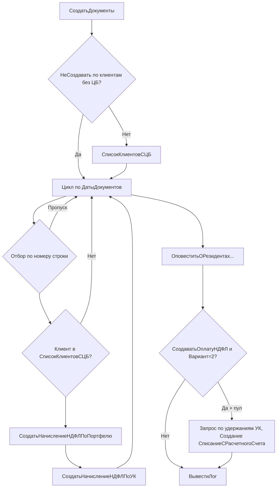

# IMDEV-7330: изыскания по обработке «Формирование начислений НДФЛ» и документу «Начисление НДФЛ по портфелю»

Дата: 2026-04-12.

Источник кода конфигурации (рабочая выгрузка): `C:\1c\Cursor_1c\WORK\WIM_FIn\src\cf\`.

Расширение (CFE): `C:\1c\Cursor_1c\WORK\WIM_FIn\src\cfe\VTB_NDFL_Exchange\`.

## С чего начинали просмотр: расширение VTB_NDFL_Exchange

Сначала зафиксировали, **что именно подменяет расширение** относительно основной конфигурации. Перехваты сделаны **только в модулях объектов** двух заимствованных документов; других заимствований с аннотациями перехвата в этом расширении нет.

| Объект | Модуль | Перехват (аннотация) | Имя процедуры / функции в расширении |
|--------|--------|----------------------|--------------------------------------|
| Документ `НачислениеНДФЛПоПортфелю` | модуль объекта (`Documents\НачислениеНДФЛПоПортфелю\Ext\ObjectModule.bsl`) | `&ИзменениеИКонтроль("РасходыПоНКДПоВидуОбращаемости")` | `NDFL_РасходыПоНКДПоВидуОбращаемости` |
| Документ `НачислениеНДФЛПоУправляющейКомпании` | модуль объекта (`Documents\НачислениеНДФЛПоУправляющейКомпании\Ext\ObjectModule.bsl`) | `&После("ПриЗаписи")` | `NDFL_ПриЗаписи` |

Краткий смысл:

- **По портфелю:** перехвачена функция **`РасходыПоНКДПоВидуОбращаемости`** (в типовой она в модуле объекта документа по портфелю; расширение задаёт собственный текст запроса к **`РегистрБухгалтерии.Хозрасчетный`** и вспомогательные ВТ). Это попадает в цепочку **`РассчитатьНДФЛ`** при расчёте НКД / УКД по виду обращаемости, то есть на каждый полный пересчёт документа по портфелю.
- **По УК:** после **`ПриЗаписи`** при дате с 2021 года, клиенте ДУ и наличии в табличной части **`Удержания`** портфелей типа **`Справочник.ПортфелиСтороннихСистем`** выполняется регистрация ссылки документа в плане обмена **`ОбменНДФЛ`** (узел с кодом `NDFL_PIF`) для выгрузки в обмен НДФЛ.

Пути к файлам расширения в выгрузке:

- `cfe\VTB_NDFL_Exchange\Documents\НачислениеНДФЛПоПортфелю\Ext\ObjectModule.bsl`
- `cfe\VTB_NDFL_Exchange\Documents\НачислениеНДФЛПоУправляющейКомпании\Ext\ObjectModule.bsl`

## Анализ запроса: `NDFL_РасходыПоНКДПоВидуОбращаемости` (расширение VTB_NDFL_Exchange)

В функции один пакетный запрос (`Запрос.ВыполнитьПакет()`), область текста `#Область ТекстЗапроса` в файле модуля расширения. Ниже блоки **в порядке следования** в пакете (каждый фрагмент до `;` / разделителя `////////////////////////////////////////////////////////////////////////////////`).

### Блок 1. Временная таблица `ОплаченныеКупоныЗаПериод`

- **Источник:** `РегистрБухгалтерии.Хозрасчетный.ОборотыДтКт`.
- **Смысл:** отбор оплат купонного дохода за период по портфелю: счет Дт из набора **`СчетаДенежныхСредств`** (из `ПараметрыРасчета`), счет Кт из **`РасчетыПоОблигациям`**, период **`НачалоПериода` … `КонецПериода`** (конец периода в коде задаётся как **`МоментВремени()`**).
- **Результат:** пары **Купон** (`СубконтоКт3`), **Облигация** (`СубконтоКт2`), сумма оборота. Эта ВТ дальше используется как справочник купонов для отборов в третьей части объединения блока 2.

### Блок 2. Временная таблица `ВТ_РасходыПоНКД` (три части `ОБЪЕДИНИТЬ ВСЕ`)

Одна общая структура полей (счет, вид обращаемости ЦБ, суммы БУ/НУ по обороту и Дт/Кт, актив, корсчёт, регистратор, период, партия, вид актива, портфель).

1. **Часть А — обычные обороты по расходам НКД**  
   - `Хозрасчетный.Обороты` по счетам **`РасходыПоУплаченномуНКД`** (параметр из плана счетов, строка `91.02.02`), субконто по виду из **`ВидыСубконто`** (ЦБ + вид обращаемости), отбор **`Портфель = &Портфель`**.  
   - Исключаются движения с регистратором **`Документ.ПереводНКДВЗадолженностьЭмитента`**.

2. **Часть B — обороты по тем же счетам для документа «Перевод НКД…»**  
   - Тот же тип виртуальной таблицы **`Обороты`**, но **`ГДЕ Регистратор ССЫЛКА Документ.ПереводНКДВЗадолженностьЭмитента`**.  
   - В тексте присутствуют директивы слияния с основной конфигурацией **`#Удаление` / `#Вставка`**: в одной сборке отбор по периоду и по **`КорСубконто2 В (ВЫБРАТЬ Купон ИЗ ОплаченныеКупоныЗаПериод)`** заменяется на вариант с **`КорСчет В (&УплаченныйНКД)`** и иной нижней границей периода (`&НачалоПериода` во вставке). Смысл — развести логику учёта перевода НКД относительно типового запроса.

3. **Часть C — снова «Перевод НКД…», связь с купонами по `КорСубконто3`**  
   - `Обороты` с отбором **`КорСубконто3 В (ВЫБРАТЬ Купон ИЗ ОплаченныеКупоныЗаПериод)`** и **`КорСчет В (&РасчетыПоОблигациям)`**, верхняя граница периода **`&КонецПериода`**, нижняя не задана (с начала учёта до конца периода в фрагменте запроса).

Итог блока 2 — единая выборка расходов по НКД по портфелю с разделением сценариев без/с документом перевода НКД и с опорой на оплаченные купоны.

### Блок 3. Временная таблица `РезультирующаяТаблица`

- **Источник:** `ВТ_РасходыПоНКД` **`ЛЕВОЕ СОЕДИНЕНИЕ`** `Справочник.Облигации` по **`ВТ_РасходыПоНКД.Актив.Объект = Облигации.Ссылка`**.
- **Смысл:** к каждой строке расхода добавляются реквизиты облигации (дата выпуска, эмитент-нерезидент, вид актива, валюта номинала).
- **Вычисляемые поля (много вложенных `ВЫБОР`):**  
  - суммы **`СуммаОборот`**, **`СуммаОборотДт`**, **`СуммаОборотКт`** с учётом флага **`РасчетСуммыНДФЛВыполнятьПоСуммамНалоговогоУчета`** (БУ vs НУ);  
  - обнуление или выделение **льготных** сумм (`СуммаОборотЛьгота`, `…Дт`, `…Кт`) по спискам активов **`АктивыСЛьготируемымКДРФИСоюзныхГосударств`**, **`АктивыСЛьготируемымКДРФ`**, **`ОблигацииЭмитентовНерезидентов`**, признаку клиента **`НеРезидент`**, пороговым датам **`Дата_02082021`**, **`Дата_01012021`**;  
  - признаки **`ЭтоЛьготируемаяОблигация`**, **`ОтражатьСтрокуВ3023`** (связка счетов доходов/расходов НКД и регистратора-перевода для кода 3023).

Это самый «широкий» блок по числу полей и ветвлений; все параметры льгот и дат приходят из **`ПараметрыРасчета`**, уже собранного в `РассчитатьНДФЛ`.

### Блок 4. Результат пакета для разреза **«по регистраторам»**

- **Источник:** `РезультирующаяТаблица`.
- **Отбор:** счет в **`РасходыПоУплаченномуНКД`**, вид обращаемости в переданном **`&ВидыОбращаемости`** (аргумент функции), ненулевые суммы по Дт (включая льготные колонки), **`НЕ ОтражатьСтрокуВ3023`**.
- **Агрегация:** `СГРУППИРОВАТЬ ПО` актив, период, партия, дата партии, регистратор; в выборке **`СУММА`** по суммам Дт и льготам.

В коде после пакета эта таблица берётся как **`Пакет[Пакет.Количество() - 2]`**, к ней добавляется колонка **`Корректировка`**, затем в цикле накладывается **`КорректировкаФинРезультатаКупонныйДоход`** (уже вне запроса, на сервере 1С).

### Блок 5. Результат пакета для разреза **«по партиям»**

- Аналогично блоку 4: те же отборы из **`РезультирующаяТаблица`**, иная группировка/набор агрегатов (в выборке нет колонки **`Регистратор`** в группировке, иначе состав сумм по льготам эмитента-нерезидента).
- В коде используется как **`Пакет[Пакет.Количество() - 1]`**; далее из таблицы «по регистраторам» строится копия и **`Свернуть`** по партиям для возврата структуры **`ПоПартиям` / `ПоРегистраторам`**, при необходимости инвертируются знаки, если **`ПараметрыРасчета.РасходыОтУКДУменьшаютДоходы`**.

### Замечания для оптимизации

- Пакет последовательно читает **`Хозрасчетный`** несколько раз (ДтКт для купонов + несколько **`Обороты`** с разными отборами по регистратору и корсубконто).
- Соединение со **`Справочник.Облигации`** по полному набору строк **`ВТ_РасходыПоНКД`** утяжеляет третий блок при большом числе движений.
- Конец периода **`МоментВремени()`** расширяет выборку относительно «даты документа»; при профилировании стоит проверить согласованность с типовым **`ПараметрыРасчета.КонецПериода`**, если он в типовой функции отличался.

## 1. Объект обработки

- **Метаданные:** `Обработка.ФормированиеНачисленийНДФЛ`
- **Модуль объекта:** `DataProcessors\ФормированиеНачисленийНДФЛ\Ext\ObjectModule.bsl`

### 1.1. Точки входа

| Процедура | Назначение |
|-----------|------------|
| `ЗаполнитьДатыДокументов()` | Заполняет таблицу `ДатыДокументов` по варианту `ВариантЗаполнения` (0..3). |
| `СоздатьДокументы(ТабличныйДокумент)` | Основной регламент: проход по `ДатыДокументов`, создание документов НДФЛ, вывод лога в табличный документ. |

### 1.2. Варианты заполнения `ДатыДокументов`

| Значение | Вызываемая процедура | Смысл |
|----------|----------------------|-------|
| 1 | `ЗаполнитьПоОборотамСчета79_01()` | Дни с оборотами по БУ счету 79.01 (`РегистрБухгалтерии.Хозрасчетный.Обороты`). |
| 0 | `ЗаполнитьПоСуществующимНачислениямНДФЛ()` | Уникальные пары клиент / УК / дата по проведённым документам `НачислениеНДФЛПоПортфелю` и `НачислениеНДФЛПоУправляющейКомпании` за период. |
| 2 | `ЗаполнитьДокументамиНаДату()` | Сложный пакет: РС `ВыплатаДохода`, обороты `НДФЛСведенияОДоходах`, обороты `Хозрасчетный` по 68.01, объединение со `Справочник.Портфели` при отключённом фильтре `ФормироватьНачисленияТолькоПоПортфелямСДвижениямиПоНДФЛ`. |
| 3 | `ЗаполнитьДаннымиСтороннихСистем()` | Документы `ДанныеПоНДФЛИзСтороннихСистем` из плана обмена. |

Дополнительно перед циклом при `НеСоздаватьДокументыПоКлиентамБезЦБ = Ложь`: один раз вычисляется `СписокКлиентовСЦБ()` для фильтра строк без ценных бумаг.

## 2. Схема вызовов при `СоздатьДокументы`

### 2.1. Цикл по клиенту / УК / дате (`СтрокаДокументов`)

Для каждой строки `ДатыДокументов` последовательно:

1. **`СоздатьНачислениеНДФЛПоПортфелю(СтрокаДокументов, СписокСообщений)`**  
   - Условие: константа `НачислениеНДФЛПоПортфелю`.  
   - `СписокПортфелей = СписокПортфелей(СтрокаДокументов)` — запрос к `Справочник.Портфели` и при `ФормироватьПоЗакрытымПортфелямСПоступлениемНКД` объединение с `Документ.ПоступлениеНаРасчетныйСчет`.  
   - Для **каждого** портфеля: `НайтиСоздатьДокументПоПортфелю` → `РассчитатьНДФЛ()` на объекте документа → проверка даты смерти → `Записать(Проведение)` / при ошибке `Записать(Запись)`.

2. **`СоздатьНачислениеНДФЛПоУК(...)`**  
   - `НайтиСоздатьДокументПоУК` → `РассчитатьНДФЛ()` документа по УК.  
   - Если `НеСоздаватьДокументыБезУдержаний` и `Удержания.Итог("СуммаКУдержанию") = 0` → **`Возврат`** без записи документа по УК.  
   - Иначе проверка даты смерти → запись с проведением.

## 3. «Тяжёлые» запросы в модуле обработки

Все запросы в `ObjectModule.bsl` обработки; самые затратные по природе данных (обороты БУ, накопительные регистры, большие временные таблицы):

| Место (процедура, ориентир строк) | Регистр / источник | Комментарий |
|-----------------------------------|-------------------|-------------|
| `СписокКлиентовСЦБ` (~271) | `РегистрБухгалтерии.Хозрасчетный.Остатки` по счетам 58, фильтр по клиентам из `ДатыДокументов` | Один раз на выполнение `СоздатьДокументы`, но по всем клиентам таблицы. |
| `ЗаполнитьПоОборотамСчета79_01` (~415) | `Хозрасчетный.Обороты` по 79.01, группировка по регистратору и дню | Период обработки; фильтры УК / клиент. |
| `ЗаполнитьПоСуществующимНачислениямНДФЛ` (~490) | `Документ.НачислениеНДФЛПоПортфелю`, `Документ.НачислениеНДФЛПоУправляющейКомпании` | Полный скан проведённых за интервал; `ВЫРАЗИТЬ` к `ПуловоеНачислениеДивидендов`. |
| `ЗаполнитьДокументамиНаДату` (~574) | РС `ВыплатаДохода.СрезПоследних`; `НДФЛСведенияОДоходах.Обороты` (период, день); `Хозрасчетный.Обороты` по 68.01; `ОБЪЕДИНИТЬ` со `Справочник.Портфели` | Самый большой пакет: несколько ВТ, `ОБЪЕДИНИТЬ ВСЕ`, фильтры `ПоПортфелямСДвижениямиПоНДФЛ` / `ПоЗакрытымПортфелям`. |
| `ЗаполнитьДаннымиСтороннихСистем` (~746) | `Документ.ДанныеПоНДФЛИзСтороннихСистем` | Обычно уже ограничен списком из обмена. |
| `СписокПортфелей` (~792) | `Справочник.Портфели` + `Документ.ПоступлениеНаРасчетныйСчет` | Выполняется **на каждую** `СтрокаДокументов` в цикле перед портфелями. |
| `НайтиСоздатьДокументПоПортфелю` (~312) | `Документ.НачислениеНДФЛПоПортфелю` (`ВЫБРАТЬ ПЕРВЫЕ 1`) | Лёгкий, но частый при многих портфелях. |
| `НайтиСоздатьДокументПоУК` (~358) | `Документ.НачислениеНДФЛПоУправляющейКомпании` + ЛСО с `ПуловоеНачислениеДивидендов` | На каждую строку дат. |
| Блок оплаты НДФЛ в `СоздатьДокументы` (~50) | ТЧ `НачислениеНДФЛПоУправляющейКомпании.Удержания` по `СписокНачислений` | После цикла, если включена оплата и пуловый учёт. |

Логирование текстов запросов: `ОбщегоНазначенияДУ.ДобавитьВЛогОтладки(Запрос, "ИмяПроцедуры")` для части заполнений.

## 4. Документ `НачислениеНДФЛПоПортфелю`

- **Модуль объекта:** `Documents\НачислениеНДФЛПоПортфелю\Ext\ObjectModule.bsl` (очень большой модуль).

### 4.1. `РассчитатьНДФЛ()` (экспорт)

Краткая логика:

1. `Начисления.Очистить()`, `ОбщиеРасходы.Очистить()`.
2. **`ПараметрыРасчета = ПараметрыРасчета()`** — агрегирует большой набор данных в структуру (см. ниже): это **одна из основных точек нагрузки** на один вызов расчёта по портфелю.
3. Последовательные функции видов дохода (`Расчет1530`, `Расчет1531`, … `Расчет4800` и др.), сборка `ТаблицаРасчета`.
4. Учёт начислений из сторонних систем, льготы, распределение общих расходов / сальдирование (зависит от прогрессивной шкалы).
5. `ДобавитьВНачисления(ТаблицаРасчета)`, `ЗаполнитьУдержания`, справка-расчёт в `ХранилищеЗначения`.

### 4.2. `ПараметрыРасчета()` — что подтягивается один раз

Без полного перечисления всех внутренних функций, ключевые группы обращений к данным (ориентир строк ~3627–3766):

- `РегистрСведений.ЗначенияПараметровПортфеля`, `РезидентствоКонтрагентов`, `КлиентыПодСанкциями`.
- Справочники: соответствия кодов ИИС / физлица, константы статей исключений.
- **`СписокДокументовДляРасчетаДоходовРасходов`** — формирует списки документов и таблицы сделок / БП за период (тяжело по объёму).
- **`ОбщиеОбороты`**, **`ОбщаяТаблицаДоходовРасходНКД`**, доходы / расходы по переоценке, комиссии, **`ОбщиеКомиссии`**, **`ВознагражденияУК`** — запросы к `Хозрасчетный` (в т.ч. `ОборотыДтКт`) с отбором `Портфель = &Портфель`.
- Таблицы льгот: `РегистрСведений.ЦБВысокотехнологичногоСектораЭкономики`, `ЦБККоторымПрименимаПятилетняяЛьгота`.
- Настройки расчётов по видам обращаемости, РЕПО, 3023, 4800, 2640, 1532 — отдельные функции со своими запросами.

Далее `Расчет1530` и аналоги работают **преимущественно** с уже загруженными таблицами из `ПараметрыРасчета`, но внутри модуля много дополнительных `Запрос` к БУ (например, `Хозрасчетный.ОборотыДтКт` для инвествычета по НКД и др.).

### 4.3. Поведение при «пустых» начислениях (зафиксированные выводы)

- В **`СоздатьНачислениеНДФЛПоПортфелю`** нет условия вида «если после запроса / `РассчитатьНДФЛ` нет строк в `Начисления`, не создавать документ». Объект документа создаётся или находится, выполняется расчёт, затем запись (если не `Продолжить` по дате смерти).
- Для документа **по УК** в обработке есть ограничение: **`НеСоздаватьДокументыБезУдержаний` и нулевые `Удержания`** — ранний `Возврат` без записи (это про **удержания**, не про пустоту табличной части начислений по портфелю в запросе).
- Исключение записи по портфелю в обработке: ветка **`ДатаСмертиНаступила`** — `Продолжить` без `Записать` (для нового объекта документ в БД не появится).

В `ОбработкаПроверкиЗаполнения` модуля документа в проверяемые реквизиты добавляются поля ТЧ `Начисления` (ставка / тип дохода в зависимости от шкалы); при **пустой** табличной части стандартная проверка часто не даёт ошибок по этим полям (нет строк для проверки), но проведение и движения зависят от реализации `СформироватьДвижения`.

## 5. Профиль нагрузки (для оптимизации IMDEV-7330)

1. **Умножение по портфелям:** для каждого дня / клиента / УК для каждого портфеля — полный `РассчитатьНДФЛ()` с полным `ПараметрыРасчета()`. Главный кандидат на кеширование, пакетную обработку или сокращение числа повторных обращений к БУ.
2. **Повторный запрос `СписокПортфелей`** на каждую строку `ДатыДокументов` при том же клиенте — можно рассмотреть один раз на клиент + дату при неизменных параметрах.
3. **`ЗаполнитьДокументамиНаДату`** — тяжёлый одинарный запрос на всю выборку периода; имеет смысл при профилировании сервера 1С выделить отдельно.
4. **Модуль документа** — многократные проходы по `Хозрасчетный` и накопительным в рамках одного расчёта; точки — функции, вычисляемые из `ПараметрыРасчета`, `ОбщиеКомиссии`, `ВознагражденияУК`.

## 6. Связь с задачей Jira

Техническое описание в этом файле собирает контекст по цепочке **обработка → документ по портфелю** для последующей оптимизации (см. каталог проекта и материалы задачи в репозитории).

---

Имя файла на латинице (`imdev7330_...`) — для удобства путей в консоли и инструментов; содержание на кириллице.
