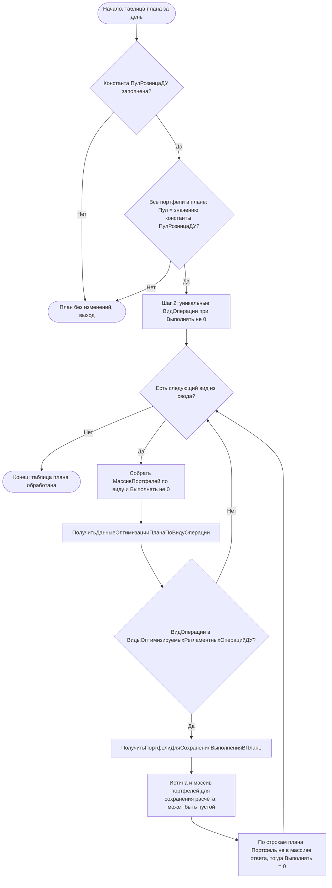

# Встраивание фильтра плана регламентных операций (IMDEV-8641)

## Внедрение в проде (Аванкор 2.8.5.x)

| Было (черновик RduPF) | Стало (прод) |
|----------------------|--------------|
| Перехват `ГрупповоеВыполнениеЗакрытияПериодов` + менеджер РС | EPF **`АлгоритмДопДействийПриЗакрытииДня`**, событие `ПриФормированииПланаРегламентныхОперацийЗаДень` |
| РС `ВидыОптимизируемыхРегламентныхОперацийДУ` в join | **ВТ** из 5 предопределённых видов в коде EPF |
| RduPF в ИБ | **Отключено**; код в `Расширения/RduPF/` — только источник для переноса |

Константа **`ПулРозницаДУ`** — в **типовой** конфигурации (`Constants/ПулРозницаДУ.xml`), см. [pul_roznica_du_constant.md](pul_roznica_du_constant.md).

Точка вызова в типовой (2.8.5.1): после `ПланРеглОпераций`, параметр плана — **`ПланРегламентныхОпераци`**. См. `ДоработкиОтАванкор/how_it_looks_in_code_from_docx.md`.

## Назначение и точка встраивания

Для оптимизации исполнения регламентных операций под РДУ (и схожих сценариев) требуется **после получения таблицы плана** и **до передачи её в цепочку закрытия** иметь возможность **для части строк снять признак выполнения** — установить **`Выполнять`** в значение, означающее «не выполнять» (аналог ложного условия), **не удаляя строки** из таблицы, чтобы сохранить полный перечень плана в документе `ПланРегламентныхОперацийДУ` там, где это ожидается типовой логикой.

**Точка встраивания (многопоточный режим):** процедура **`ВыполнитьМногопоточноеЗакрытиеПериодовПортфелей`** модуля объекта обработки **`ГрупповоеВыполнениеЗакрытияПериодов`** — **сразу после** вызова **`РегистрыСведений.НастройкиЗакрытияПериода.ПланРеглОпераций`** для очередного дня и **до** `ПланРеглОперацийПоДням.Вставить(День, тПланРеглОперацийПоДням)`.

Исходники базы (типовой путь): `C:\1c\Cursor_1c\WORK\WIM_FIn\src\cf\DataProcessors\ГрупповоеВыполнениеЗакрытияПериодов\Ext\ObjectModule.bsl`.

## Данные: структура таблицы плана

Источник: экспортная функция **`РегистрыСведений.НастройкиЗакрытияПериода.ПланРеглОпераций`**, файл `InformationRegisters/НастройкиЗакрытияПериода/Ext/ManagerModule.bsl`. Итоговый пакет запроса (финальный `ВЫБРАТЬ` перед `СГРУППИРОВАТЬ ПО`) задаёт состав результата.

| Имя колонки (в ТЗ) | Смысл | Тип в 1С (ожидаемый) | Примечание |
|--------------------|--------|----------------------|------------|
| **Выполнять** | Выполнять ли операцию в рамках плана | **Число** (0 / 1) | В **`ПланРеглОпераций`** — только **Число**; в ТЧ документа после переноса — **Булево**; для отсечения исполнения в таблице плана использовать **0** |
| **Портфель** | Портфель | **СправочникСсылка.Портфели** | Ключ разреза плана |
| **ВидОперации** | Вид операции закрытия периода | **СправочникСсылка.ВидыОперацийЗакрытияПериода** | Элемент справочника, не группа |
| **ВремяРеглОпераций** | Время запуска группы (из родителя вида) | **Дата** (как правило, время суток в поле типа Дата) | Берётся из `ВидыОперацийЗакрытияПериода.Родитель.ВремяРеглОпераций` |
| **Родитель** | Группа операций в иерархии видов | **СправочникСсылка.ВидыОперацийЗакрытияПериода** или **Неопределено** | Для ветки «регламентные операции ДУ» в запросе подставляется **Неопределено** вместо ссылки на группу-родителя |

Документирующий комментарий в коде перечисляет подмножество: `Портфель`, `ВидОперации`, `Выполнять`, `ВремяРеглОпераций`, `Родитель` — это совпадает с фактическим результатом запроса после группировки.

### Колонка `Выполнять`: типы и цепочка до исполнения

Проверено по выгрузке WIM_FIn: в итоговом запросе **`ПланРеглОпераций`** поле считается как **`МАКСИМУМ(...)`** от выражений **0** и **1**, поэтому в **`ТаблицаЗначений`** колонка **`Выполнять`** имеет тип **`Число`** (**0** или **1**).

**Для исключения из исполнения на этапе таблицы плана** для отобранных строк задаём **`СтрокаПлана.Выполнять = 0`** (строка не удаляется).

Дальше **`ФоновыеЗаданияСервер.СоздатьПланРегламентныхОперацийДУ`** переносит значение в ТЧ **`Операции`** документа **`ПланРегламентныхОперацийДУ`**. В метаданных реквизит ТЧ **`Выполнять`** — **`Булево`** (`xs:boolean` в `Documents/ПланРегламентныхОперацийДУ.xml`). Значения **0** / **1** из таблицы плана при присвоении в ТЧ приводятся к **Ложь** / **Истина**. В **`ПолучитьСписокОперацийДляВыполнения`** отбор по **`ПланРегламентныхОперацийДУОперации.Выполнять`** — строки с **Ложь** не исполняются.

## Предлагаемый контракт новой процедуры

**Вариант А (процедура):** на вход — **`ТаблицаЗначений`** (результат **`ПланРеглОпераций`** за один день для набора портфелей), опционально **`ДатаЗакрытия`** (день), **`ДопПараметры`**. Процедура **изменяет таблицу на месте**, выставляя **`Выполнять = 0`** там, где это следует из **алгоритма** (раздел ниже) и **реализации** (пакетные запросы + цикл по видам операций).

**Принцип отбора строк:** логика шагов 1–3 — в **«Алгоритм отсеивания строк»**; технический порядок запросов и вызовов — в **«Реализация»**; **перечень видов операций**, для которых выполняется оптимизация, задаётся регистром сведений **`ВидыОптимизируемыхРегламентныхОперацийДУ`** со ссылками на элементы **`ВидыОперацийЗакрытияПериода`** (см. раздел **«Регистр ВидыОптимизируемыхРегламентныхОперацийДУ»** и п. **3.1** — функция **`ПолучитьДанныеОптимизацииПланаПоВидуОперации`**); **тексты запросов** функции **`ПолучитьПортфелиДляСохраненияВыполненияВПлане`** (п. **3.2**) — в отдельном описании / ТЗ на доработку. Обе функции размещаются в **модуле менеджера** этого регистра сведений (`InformationRegisters/ВидыОптимизируемыхРегламентныхОперацийДУ/Ext/ManagerModule.bsl`).

## Регистр сведений ВидыОптимизируемыхРегламентныхОперацийДУ (данные, не код)

Для решения «участвует ли **`ВидОперации`** в оптимизации под РДУ» вводится регистр сведений **`ВидыОптимизируемыхРегламентныхОперацийДУ`**. В регистре **перечислены ссылки** на **конкретные элементы** справочника **`ВидыОперацийЗакрытияПериода`** (не группы каталога): одна запись регистра — один допустимый вид (или иная согласованная схема измерений, если понадобится разрез; базовый вариант — измерение **ВидОперации** типа **`СправочникСсылка.ВидыОперацийЗакрытияПериода`**). В коде: **`РегистрыСведений.ВидыОптимизируемыхРегламентныхОперацийДУ`**.

**Проверка в алгоритме:** для текущего **`ВидОперации`** из плана выполняется проверка **наличия записи** в этом регистре с этой ссылкой (запрос к регистру или заранее подготовленное соответствие). **Не** сравниваются строки **`ИсполняемаяПроцедура`** с зашитым в коде списком имён — перечень ведётся **данными** в регистре. Сопровождение: добавление или исключение вида — **изменение записей регистра**, без правки списка в модуле.

## Алгоритм отсеивания строк

**Последовательность:** шаг **1** — разрешено ли вообще отсеивание для данной таблицы; шаг **2** — извлечь множество **`ВидОперации`** среди строк с **`Выполнять <> 0`**; шаг **3** — по каждому виду из этого множества вызвать функцию и при необходимости обнулить **`Выполнять`** у части строк (**Портфель** + **`ВидОперации`**). Если шаг **1** не пройден, шаги **2** и **3** **не выполняются**, таблица плана **не меняется**.

### Блок-схема (обзор)

Узел **«Нет»** у проверки регистра соответствует возврату **`Ложь`** из **`ПолучитьДанныеОптимизацииПланаПоВидуОперации`**: по этому виду строки плана **не меняются**, цикл переходит к следующему виду. Узел **«Да»** — для **`ВидОперации`** есть запись в **`ВидыОптимизируемыхРегламентныхОперацийДУ`**, вызывается **`ПолучитьПортфелиДляСохраненияВыполненияВПлане`** и правка **`Выполнять`**. Если **массив** портфелей из ответа **пустой**, на шаге применения обнуляются **все** строки плана с данным видом (см. п. **3.1**).

### Шаг 1. Условие применимости (обязательное)

Отсеивание **выполняется только если одновременно**:

1. **Константа `ПулРозницаДУ` заполнена** — непустая **СправочникСсылка.Пул** (эталон пула «розница ДУ»). Объект **`ПулРозницаДУ`** есть в типовой WIM_FIn; в ИБ нужно задать **значение** (пустая константа — фильтр не применяется). См. [pul_roznica_du_constant.md](pul_roznica_du_constant.md).
2. **Все портфели** из колонки **`Портфель`** таблицы плана в **`Справочник.Портфели`** имеют **`Пул`**, **строго равный** **значению константы** **`ПулРозницаДУ`**.  
   - Если есть портфель с **пустым** **`Пул`** или **`Пул` <> константа** — отсеивание **не активируется**, таблица уходит дальше **без изменений**.

Оптимизация рассчитана на **однородный** набор портфелей «только розница ДУ» при заполненной константе.

### Шаг 2. Свод видов операций (только если шаг 1 пройден)

Получить **уникальные** **`ВидОперации`** по строкам плана, где **`Выполнять <> 0`** (тип **`Число`**; **0** в свод не входит). Поведение при **`Неопределено`** в **`Выполнять`** — в ТЗ.

Результат: множество видов без дубликатов (**`ВЫБРАТЬ РАЗЛИЧНЫЕ ВидОперации`** или **`СГРУППИРОВАТЬ ПО ВидОперации`** при необходимости агрегатов). Это множество — вход для шага **3** и основа для **узких** запросов к договорам/регистрам **по виду операции**, без лишнего обхода всех строк плана.

### Шаг 3. Функции по каждому виду операции и корректировка `Выполнять`

Для **каждого** **`ВидОперации`** из свода шага **2** вызывающий код (процедура фильтра) выполняет цикл (см. **«Реализация»**): предварительно из таблицы плана собирается **`МассивПортфелей`** — **уникальные** **`Портфель`** среди строк с данным **`ВидОперации`** и **`Выполнять <> 0`**. Далее вызывается **`ПолучитьДанныеОптимизацииПланаПоВидуОперации`** (модуль менеджера РС **`ВидыОптимизируемыхРегламентныхОперацийДУ`**); при необходимости она вызывает **`ПолучитьПортфелиДляСохраненияВыполненияВПлане`**.

#### 3.1. ПолучитьДанныеОптимизацииПланаПоВидуОперации (модуль менеджера РС ВидыОптимизируемыхРегламентныхОперацийДУ)

**Назначение:** решить, участвует ли данный **`ВидОперации`** в оптимизации по РДУ (есть ли вид в регистре **`ВидыОптимизируемыхРегламентныхОперацийДУ`**), и при положительном ответе получить перечень портфелей, для которых расчёт **оставляем** (остальным с этим видом — **`Выполнять = 0`**).

**Вход:**

- **`ВидОперации`** — **`СправочникСсылка.ВидыОперацийЗакрытияПериода`**;
- **`День`** — дата закрытия (тот же смысл, что и день плана в цепочке **`ПланРеглОпераций`**);
- **`МассивПортфелей`** — **`Массив`** уникальных **`СправочникСсылка.Портфели`**, встречающихся в плане по этому **`ВидОперации`** при **`Выполнять <> 0`** (формирует вызывающий код из **`ТаблицаЗначений`** плана). Без этого набора нельзя вызвать **`ПолучитьПортфелиДляСохраненияВыполненияВПлане`** для отбора «своих» портфелей.

**Логика:**

1. **Перечень допустимых видов** хранится в регистре сведений **`ВидыОптимизируемыхРегламентныхОперацийДУ`**: в записях — **ссылки на элементы** **`Справочник.ВидыОперацийЗакрытияПериода`** (см. раздел выше). Для текущего **`ВидОперации`** выполняется проверка **наличия соответствующей записи** в этом регистре (по ссылке на тот же элемент справочника). Перечень **не** задаётся зашитым в коде списком строк **`ИсполняемаяПроцедура`**.
2. **Реквизит справочника** **`ИсполняемаяПроцедура`** по-прежнему используется в типовой цепочке исполнения (**`ПолучитьСписокОперацийДляВыполнения`** и др.); для **данной** доработки отбор «входит / не входит в оптимизацию» определяется **только регистром** и ссылкой **`ВидОперации`**, а не сравнением текста процедуры с константами в коде.
3. Если для **`ВидОперации`** **нет** записи в **`ВидыОптимизируемыхРегламентныхОперацийДУ`** — возврат **`Структура`**: флаг **`Ложь`**. **Второй ключ не используется.** По этому виду операции строки плана **не меняем**.
4. Если **запись есть** — вызывается **`ПолучитьПортфелиДляСохраненияВыполненияВПлане`** (п. **3.2**) с параметрами **`МассивПортфелей`**, **`День`**, **`ВидОперации`**. По её результату формируется возврат **`Структура`**: флаг **`Истина`** и **второй ключ** — **`Массив`** ссылок **`СправочникСсылка.Портфели`**: либо **пустой массив**, либо содержит портфели, для которых расчёт **оставляем** (без обёртки в **`ТаблицаЗначений`**).

**Смысл второго ключа при `Истина`:** портфели, **вошедшие в массив** результата **`ПолучитьПортфелиДляСохраненияВыполненияВПлане`**, — те, по которым **`Выполнять`** в плане **не трогаем**; по **всем остальным** портфелям с тем же **`ВидОперации`** (в пределах исходного плана) — **`Выполнять = 0`**.
Если **`ПолучитьПортфелиДляСохраненияВыполненияВПлане`** вернула **пустой** **`Массив`** — **ни один** портфель не попал в перечень «оставить расчёт», значит для **всех** строк плана с данным **`ВидОперации`** (и **`Выполнять <> 0`** до правки) выставляем **`Выполнять = 0`**.

#### 3.2. ПолучитьПортфелиДляСохраненияВыполненияВПлане (модуль менеджера РС ВидыОптимизируемыхРегламентныхОперацийДУ)

**Назначение:** по конкретной комбинации **`ВидОперации`** (уже отобранной по регистру **`ВидыОптимизируемыхРегламентныхОперацийДУ`**), **`Дня`** и ограниченному **`МассивПортфелей`** из плана выполнить **специализированные запросы** и вернуть подмножество портфелей, для которых операцию **оставляем в исполнении**.

**Вход:** **`МассивПортфелей`**, **`День`**, **`ВидОперации`**.

**Логика (на уровне ТЗ, без конкретного текста запросов):**

- Реализация — **одно ветвление по виду операции** в стиле встроенного языка: **`Если ... Тогда`** для первого вида, далее **`ИначеЕсли ... Тогда`** для остальных, завершает цепочку **`Иначе`**. Сравнение **`ВидОперации`** — с **конкретными ссылками** на элементы справочника **`ВидыОперацийЗакрытияПериода`** (не по строке **`ИсполняемаяПроцедура`**).
- **Пять веток** (имена в справочнике — ориентир, как в [imdev8641_development_brief.md](imdev8641_development_brief.md), раздел 4):  
  **`НачислениеПроцентовПоБанковскимСчетамПоГрафику`**, **`ПереводНКДЭмитента_БУ`**, **`ОпределениеСделокСОтклонениемЦен_БУ`**, **`ПогашениеОблигаций_БУ_ДоПереоценки`**, **`ЧастичноеПогашениеОблигаций_БУ`**.  
  В каждой ветке выполняются **свои** специализированные запросы (тексты — отдельная проработка); на выходе ветки — **`Массив`** портфелей из **`МассивПортфелей`**, для которых операцию **оставляем** (подмножество входного массива или **пустой** массив, если ни одному портфелю расчёт не нужен).
- Набор и текст запросов в каждой ветке **определяются отдельно** по аналогии с теми запросами и объектами метаданных, которыми в конфигурации уже пользуются для **подготовки исходных данных** при выполнении **этой же** регламентной операции (те же договоры, регистры, связи портфель–договор и т.д., что и в типовой цепочке исполнения).
- **`Иначе`** (ни одна из пяти веток не сработала): **немедленный возврат того же состава**, что и на входе — **`Массив`**, совпадающий с переданным **`МассивПортфелей`** (по ссылкам те же элементы). По смыслу для вызывающего кода это **«ничего не отсекаем»**: для всех портфелей из входного массива **`Выполнять`** в плане **не меняем**. Такая ветка нужна для защиты при расхождении регистра и кода до появления шестой ветки и как явное поведение по умолчанию.
- На выходе в общем случае — **`Массив`** ссылок **`СправочникСсылка.Портфели`**: **пустой**, **непустое подмножество** входного **`МассивПортфелей`** или **полная копия** входного массива при срабатывании **`Иначе`**. Других форматов (таблица значений с колонкой **`Портфель`**) в контракте **нет**.

**Уточнение:** отдельные ветки при желании можно вынести во **вспомогательные функции** того же модуля менеджера с сохранением общего контракта **`МассивПортфелей`**, **`День`**, **`ВидОперации`** на вход и **`Массив`** на выход.

#### 3.3. Применение результата к таблице плана

Цикл по видам из шага **2** выполняется **в коде**; для каждого вида — вызов **`ПолучитьДанныеОптимизацииПланаПоВидуОперации`** с **`ВидОперации`**, **`День`** и собранным **`МассивПортфелей`**, затем обновление **исходной** **`ТаблицаЗначений`** плана по правилам п. **3.1** (флаг **`Ложь`** — пропуск вида; **`Истина`** + **массив** портфелей — обнуление **`Выполнять`** у строк, чей **`Портфель`** **не** входит в этот массив).

**Итог:** единственное место массового присвоения **`Выполнять = 0`** в рамках доработки — правила шага **3**; тип **0** в таблице плана — раздел **«Колонка `Выполнять`»**.

## Реализация: запросы, производительность, порядок вызовов

В таблице плана за день — **много строк** и **десятки тысяч** уникальных портфелей; обход портфелей в коде с чтением реквизитов по одному **нежелателен**.

### Ранний выход

Если **`НЕ ЗначениеЗаполнено(ПулРозницаДУ)`** — процедура **сразу** завершается **без** отсеивания и **без** тяжёлого запроса (шаг **1** формально не пройден).

### Рекомендуемый порядок внутри процедуры

1. Параметр **`&ТаблицаПлана`**: **первый пакет** — **`ПОМЕСТИТЬ ВТ_План`** из полной таблицы плана (нужны как минимум **`Портфель`**, **`ВидОперации`**, **`Выполнять`**).
2. **Проверка шага 1 (пул):** из **`ВТ_План`** — **`ВЫБРАТЬ РАЗЛИЧНЫЕ Портфель ПОМЕСТИТЬ ВТ_ПортфелиПлана`**, соединение с **`Справочник.Портфели`**, сравнение **`Пул`** с **`&ПулРозницаДУ`**. Варианты проверки «все подходят»: сравнение **`КОЛИЧЕСТВО(РАЗЛИЧНЫЕ Портфель)`** с числом строк после **`ВНУТРЕННЕЕ СОЕДИНЕНИЕ`** при **`Портфели.Пул = &ПулРозницаДУ`**; либо **`ВЫБРАТЬ ПЕРВЫЕ 1 ...`** при **`Пул <> &ПулРозницаДУ`** или пустом **`Пул`** (если это прерывает алгоритм). Если шаг **1** не выполнен — **дальнейшие пакеты не использовать**, таблицу плана не менять.
3. **Шаг 2 в запросе:** из **`ВТ_План`** строки **`ГДЕ Выполнять <> 0`**, при необходимости **`ПОМЕСТИТЬ ВТ_СтрокиСИсполнением`**, затем **`ВЫБРАТЬ РАЗЛИЧНЫЕ ВидОперации ПОМЕСТИТЬ ВТ_ВидыОперацийКОбработке`** (имена ВТ условны). Пакеты шага **1** (пул) и шага **2** (свод) удобно держать **в одном много-пакетном тексте** запроса.
4. **Шаг 3 в коде:** выгрузить множество **`ВидОперации`** из результата / **`ВТ_ВидыОперацийКОбработке`**. Для каждого вида: из **исходной** **`ТаблицаЗначений`** плана собрать **`МассивПортфелей`** (уникальные **`Портфель`**, где **`ВидОперации`** совпадает и **`Выполнять <> 0`**); вызвать **`ПолучитьДанныеОптимизацииПланаПоВидуОперации`** (**`ВидОперации`**, **`День`**, **`МассивПортфелей`**); по **`Структура`**-ответу в той же таблице плана выставить **`Выполнять = 0`** (см. п. **3.1**–**3.3**).

### Дополнительные пакеты

Сбор данных для **`ПолучитьПортфелиДляСохраненияВыполненияВПлане`** выполняется **внутри неё** (запросы по **`МассивПортфелей`**, **`День`**, **`ВидОперации`**). При необходимости общие ВТ можно подготовить **дополнительными пакетами** до цикла по видам (к **`ВТ_План`** и т.д.) — по усмотрению реализации, без обхода всего плана по одному портфелю в коде.

## Связь с дальнейшей цепочкой

- Таблица по дням складывается в **`ДопПараметры.ПланРеглОперацийПоДням`** (`Соответствие`: ключ — дата дня, значение — `ТаблицаЗначений`).
- В **`СформироватьРеглОперацииПоГруппе`** из этой таблицы отбираются строки по **`Портфель`** и **`Родитель`**, затем вызывается **`ФоновыеЗаданияСервер.СоздатьПланРегламентныхОперацийДУ`** с нарезанной таблицей **`РеглОперации`** и колонкой **`Выполнять`**.

Корректировка **`Выполнять`** **до** помещения в **`ПланРеглОперацийПоДням`** нужна для согласованности всех потоков, использующих кэш.

## Однопоточный режим

**Вне скоупа:** ветка без **`ПланРеглОперацийПоДням`** (многопоточное закрытие выключено) **не изменяется**.

## См. также

- [plan_reg_oper_du_group_closure_chain.md](plan_reg_oper_du_group_closure_chain.md) — цепочка вызовов и объекты.
- Модуль: `НастройкиЗакрытияПериода` — функция **`ПланРеглОпераций`**.
- Модуль объекта: **`ГрупповоеВыполнениеЗакрытияПериодов`** — **`ВыполнитьМногопоточноеЗакрытиеПериодовПортфелей`**, **`СформироватьРеглОперацииПоГруппе`**.
- **`CommonModules/ФоновыеЗаданияСервер`**, функция **`СоздатьПланРегламентныхОперацийДУ`** — перенос **`Выполнять`** в документ.
- **`Documents/ПланРегламентныхОперацийДУ`**, модуль объекта **`ПолучитьСписокОперацийДляВыполнения`** — отбор по **`Выполнять`** при исполнении; там же используется связка вида операции с **`ИсполняемаяПроцедура`**.
- **Регистр сведений** **`ВидыОптимизируемыхРегламентныхОперацийДУ`** (создаётся в рамках задачи) — строки со **ссылками** на **`ВидыОперацийЗакрытияПериода`**; по нему решается, вызывать ли ветку оптимизации для вида.
- **`Catalogs/ВидыОперацийЗакрытияПериода`**, реквизит **`ИсполняемаяПроцедура`** — типовая связка вида с процедурой исполнения; перечень видов для **данной** доработки задаётся регистром **`ВидыОптимизируемыхРегламентныхОперацийДУ`**, а не сравнением этой строки с кодом.
- **`CommonModules/ИсполняемыеПроцедурыЗакрытияПериода`** — реализации процедур по видам; при ветвлении в **`ПолучитьПортфелиДляСохраненияВыполненияВПлане`** могут использоваться те же имена, что в **`ИсполняемаяПроцедура`**, без дублирования перечня в коде как «белого списка строк».
