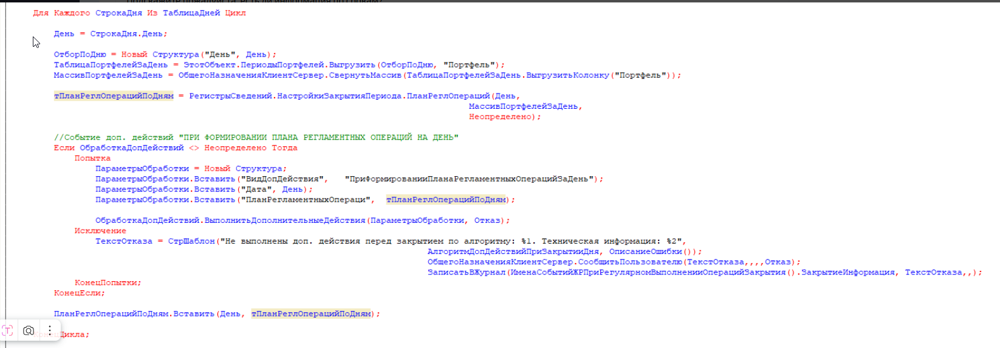
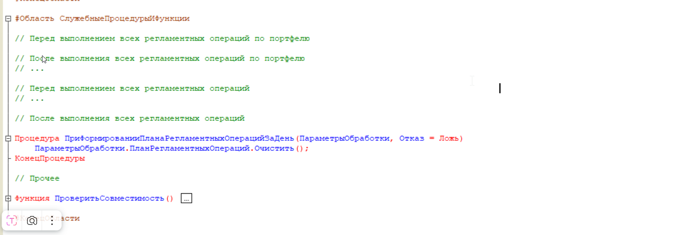

# Kak vyglyadit v kode (extract from docx)

Источник: `КакВыглядитВКоде.docx`  
Автор в docx: Коцарев Павел, 01.06.2026 — решение в поставке **2.8.5.0+**.

Проверено в типовой WIM_FIn **2.8.5.1** (`WORK/WIM_FIn`, `ГрупповоеВыполнениеЗакрытияПериодов`).

Медиа: папка `how_it_looks_in_code_media/` (`image1.png`, `image2.png`).

> Текст со скриншотов восстановлен по изображениям (OCR EasyOCR давал много ошибок).  
> Шаблон EPF дублирован из `АлгоритмДопДействийПриЗакрытииДня/Ext/ObjectModule.bsl` в репозитории.

**Имя свойства плана в `ПараметрыОбработки`:** `ПланРегламентныхОпераци` (без «й» на конце) — так в типовой конфигурации и в `Релиз___2_8_5_0.txt`, не `ПланРегламентныхОпераций`.

**RduPF:** в проде **отключено**; расширение и `ManagerModule.bsl` РС — только **черновик** источника логики для EPF.

**Константа `ПулРозницаДУ`:** в типовой CF WIM_FIn (`WORK/WIM_FIn/src/cf/Constants/ПулРозницаДУ.xml`), тип `СправочникСсылка.Пул`. RduPF для константы не нужен. В EPF — `ОбщегоНазначенияДУПовтИсп.ПолучитьЗначениеКонстанты("ПулРозницаДУ")`; для теста в ИБ значение должно быть заполнено. Подробнее: `Документация/pul_roznica_du_constant.md`.

---

## Текст из docx (параграфы)

Как выглядят доработки:

Коцарев Павел, 6/1/2026, 7:38:54 PM

Коллеги, прошу прощения, произошла небольшая путаница. Решение уже доступно в поставке **2.8.5.0**.

**Точка входа:** (см. скрин 1)

**Пример очистки плана рег. операции:** (см. скрин 2)

Шаблон внешней обработки, в самом шаблоне есть подробные комментарии: `ПримерВнешнейОбработкиПоЗакрытиюПериода.epf`

Связанные файлы в каталоге:

- `Релиз___2_8_5_0.txt` — инструкция по переносу логики из РС
- `АлгоритмДопДействийПриЗакрытииДня.xml` / `.epf` — метаданные и сборка EPF
- `АлгоритмДопДействийПриЗакрытииДня/Ext/ObjectModule.bsl` — разобранный модуль объекта (шаблон)

---

## Скрин 1: точка входа в типовой обработке



Фрагмент цикла по дням в **ГрупповоеВыполнениеЗакрытияПериодов** (после `ПланРеглОпераций`, до `ПланРеглОперацийПоДням.Вставить`):

```bsl
Для Каждого СтрокаДня Из ТаблицаДней Цикл

    День = СтрокаДня.День;

    ОтборПоДню = Новый Структура("День", День);
    ТаблицаПортфелейЗаДень = ЭтотОбъект.ПериодыПортфелей.Выгрузить(ОтборПоДню, "Портфель");
    МассивПортфелейЗаДень = ОбщегоНазначенияКлиентСервер.СвернутьМассив(
        ТаблицаПортфелейЗаДень.ВыгрузитьКолонку("Портфель"));

    тПланРеглОперацийПоДням = РегистрыСведений.НастройкиЗакрытияПериода.ПланРеглОпераций(
        День,
        МассивПортфелейЗаДень,
        Неопределено);

    // Событие доп. действий "ПРИ ФОРМИРОВАНИИ ПЛАНА РЕГЛАМЕНТНЫХ ОПЕРАЦИЙ НА ДЕНЬ"
    Если ОбработкаДопДействий <> Неопределено Тогда
        Попытка
            ПараметрыОбработки = Новый Структура;
            ПараметрыОбработки.Вставить("ВидДопДействия", "ПриФормированииПланаРегламентныхОперацийЗаДень");
            ПараметрыОбработки.Вставить("Дата", День);
            ПараметрыОбработки.Вставить("ПланРегламентныхОпераци", тПланРеглОперацийПоДням);

            ОбработкаДопДействий.ВыполнитьДополнительныеДействия(ПараметрыОбработки, Отказ);
        Исключение
            ТекстОтказа = СтрШаблон(
                "Не выполнены доп. действия перед закрытием по алгоритму: %1. Техническая информация: %2",
                АлгоритмДопДействийПриЗакрытииДня,
                ОписаниеОшибки());
            ОбщегоНазначенияКлиентСервер.СообщитьПользователю(ТекстОтказа, , , , Отказ);
            ЗаписатьВЖурнал(
                ИменаСобытийЖРПриРегулярномВыполненииОперацийЗакрытия().ЗакрытиеИнформация,
                ТекстОтказа, , , );
        КонецПопытки;
    КонецЕсли;

    ПланРеглОперацийПоДням.Вставить(День, тПланРеглОперацийПоДням);

КонецЦикла;
```

**Важно для IMDEV-8641:**

| Параметр | Значение |
|----------|----------|
| `ВидДопДействия` | `"ПриФормированииПланаРегламентныхОперацийЗаДень"` |
| `Дата` | день плана |
| `ПланРегламентныхОпераци` | таблица плана на день (`ТаблицаЗначений`, изменяется по ссылке) |

Внешняя обработка подключается через реквизит **АлгоритмДопДействийПриЗакрытииДня** (справочник **Дополнительные отчеты и обработки** / настройка **НастройкиЗакрытияПортфелейПоРасписанию**).

---

## Скрин 2: пример «очистки плана» во внешней обработке



Учебный пример в шаблоне EPF (не production-логика IMDEV-8641 — только демонстрация события):

```bsl
#Область СлужебныеПроцедурыИФункции

// Перед выполнением всех регламентных операций по портфелю
// ...

// После выполнения всех регламентных операций по портфелю
// ...

// Перед выполнением всех регламентных операций
// ...

// После выполнения всех регламентных операций
// ...

Процедура ПриФормированииПланаРегламентныхОперацийЗаДень(ПараметрыОбработки, Отказ = Ложь)

    ПараметрыОбработки.ПланРегламентныхОпераци.Очистить();

КонецПроцедуры

// Прочее

Функция ПроверитьСовместимость()
    // ...
КонецФункции

#КонецОбласти
```

Для **IMDEV-8641** вместо `Очистить()` в эту процедуру переносится фильтрация плана (бывший `ОтфильтроватьПланРеглОперацийНаДень`) с изменением только колонки **Выполнять**.

---

## Полный модуль объекта шаблона `АлгоритмДопДействийПриЗакрытииДня`

Файл в репозитории: `АлгоритмДопДействийПриЗакрытииДня/Ext/ObjectModule.bsl`

```bsl
#Область ПрограммныйИнтерфейс

Функция СведенияОВнешнейОбработке() Экспорт
	
	РезультатПроверки = ПроверитьСовместимость();
	Если РезультатПроверки.Отказ Тогда
		ВызватьИсключение(РезультатПроверки.ТекстСообщения);
	КонецЕсли;
	
	ПараметрыРегистрации = ДополнительныеОтчетыИОбработки.СведенияОВнешнейОбработке();
	ПараметрыРегистрации.Вид = ДополнительныеОтчетыИОбработкиКлиентСервер.ВидОбработкиДополнительнаяОбработка();
	ПараметрыРегистрации.Версия = Версия();
	ПараметрыРегистрации.БезопасныйРежим = Ложь;
	ПараметрыРегистрации.ВерсияБСП	= СтандартныеПодсистемыСервер.ВерсияБиблиотеки();
	
	Команда = ПараметрыРегистрации.Команды.Добавить();
	Команда.Представление = Метаданные().Синоним + " (настройки)";
	Команда.Идентификатор = Метаданные().ПолноеИмя();
	Команда.Использование = ДополнительныеОтчетыИОбработкиКлиентСервер.ТипКомандыОткрытиеФормы();
	Команда.ПоказыватьОповещение = Ложь;
	
	Возврат ПараметрыРегистрации;
	
КонецФункции

Функция Версия() Экспорт
	
	Возврат "1.00";
	
КонецФункции 

Процедура УстановитьНастройки(НастройкиОбработки) Экспорт
	
КонецПроцедуры

Процедура ВыполнитьДополнительныеДействия(ПараметрыОбработки, Отказ = Ложь) Экспорт
	
	Если Отказ Или Не ПараметрыОбработки.Свойство("ВидДопДействия") Тогда 
		Возврат;
	КонецЕсли;
	
	УстановитьПривилегированныйРежим(Истина);
  		
	// Блок 1. Операции по портфелю.
	Если ПараметрыОбработки.ВидДопДействия = "ПередВыполнениемВсехРегламентныхОперацийПоПортфелю" Тогда  
		
	ИначеЕсли ПараметрыОбработки.ВидДопДействия = "ПослеВыполненияВсехРегламентныхОперацийПоПортфелю" Тогда
			
	// Блок 2. Операции по всем портфелям за период.
	ИначеЕсли ПараметрыОбработки.ВидДопДействия = "ПередВыполнениемВсехРегламентныхОпераций" Тогда 
		
	ИначеЕсли ПараметрыОбработки.ВидДопДействия = "ПослеВыполненияВсехРегламентныхОпераций" Тогда 	
		
	ИначеЕсли ПараметрыОбработки.ВидДопДействия = "ПриФормированииПланаРегламентныхОперацийЗаДень" Тогда
		ПриФормированииПланаРегламентныхОперацийЗаДень(ПараметрыОбработки, Отказ);
	КонецЕсли;	
	
	УстановитьПривилегированныйРежим(Ложь);
	
КонецПроцедуры

#КонецОбласти

#Область СлужебныеПроцедурыИФункции

Процедура ПриФормированииПланаРегламентныхОперацийЗаДень(ПараметрыОбработки, Отказ = Ложь)
	
	// Здесь вносим наш код, таблица хранится в ПараметрыОбработки.ПланРегламентныхОпераци
	
КонецПроцедуры

Функция ПроверитьСовместимость()
	
	РезультатПроверки = Новый Структура("Отказ, ТекстСообщения", Ложь, "");
	
	Если Лев(Метаданные.Имя, 3) <> "ДУ" Тогда 
		ТекстСообщения = НСтр("ru='Обработка предназначена для конфигурации ""Аванкор: Доверительное управление"".'");
		ОбщегоНазначенияДУ.ДобавитьТекстКСообщению(РезультатПроверки.ТекстСообщения, ТекстСообщения, , РезультатПроверки.Отказ); 
	КонецЕсли;
	
	МинимальнаяВерсия = "2.8.2.13";
	Если ОбщегоНазначенияКлиентСервер.СравнитьВерсии(Метаданные.Версия, МинимальнаяВерсия) < 0 Тогда 
		ТекстСообщения = СтрШаблон(НСтр("ru='Обработка предназначена для версии конфигурации %1 или старше.'"), МинимальнаяВерсия);
		ОбщегоНазначенияДУ.ДобавитьТекстКСообщению(РезультатПроверки.ТекстСообщения, ТекстСообщения, , РезультатПроверки.Отказ); 
	КонецЕсли;	
	
	Возврат РезультатПроверки;
	
КонецФункции

#КонецОбласти
```

По задаче IMDEV-8641: **каркас** `ВыполнитьДополнительныеДействия` (все ветки `ВидДопДействия`, в т.ч. пустые) **не менять** — оставить как в шаблоне вендора. Заполнить только `ПриФормированииПланаРегламентныхОперацийЗаДень` логикой из менеджера РС (`Расширения/RduPF/.../ManagerModule.bsl`; RduPF в ИБ отключено). В `Релиз___2_8_5_0.txt` вендор рекомендует убрать пустые ветки — для нашей EPF это **не делаем**.

---

## Сырые данные OCR (справочно, низкое качество)

<details>
<summary>image1.png — raw EasyOCR</summary>

```
Iгя Кахдоло Строкад:в
Таблицадней Цик т
...
```

</details>

<details>
<summary>image2.png — raw EasyOCR</summary>

```
#Область СлухебныеПроцедурыитункшии
...
```

</details>

---

## Повторный запуск извлечения

Скрипт: `Скрипты/extract_docx_with_ocr.py`

```powershell
python "bases/WIM_FIn/projects/IMDEV-8641 .../Скрипты/extract_docx_with_ocr.py"
```
